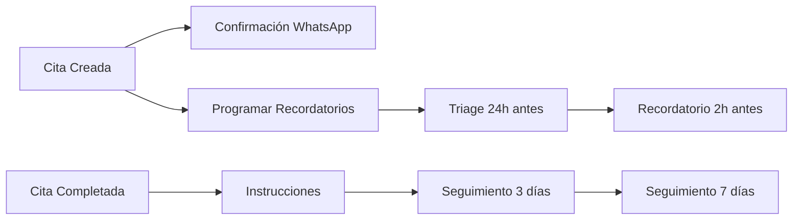

# VetConnect - Sistema Integral de Automatización Veterinaria

Sistema completo de gestión y automatización para clínicas veterinarias que centraliza la comunicación con clientes, automatiza flujos clínicos, y genera documentación automática.

## 🚀 Características Principales

### 1. **Centralización y Automatización de Comunicación**
- 📱 WhatsApp Business API integrado
- 💬 SMS vía Twilio
- 📧 Email automatizado
- 🔗 Sincronización con HubSpot CRM
- 📊 Exportación a Google Sheets

### 2. **Automatización del Flujo Clínico**
- ✅ Confirmación automática de citas
- 📋 Formularios de triage pre-consulta (24h antes)
- ⏰ Recordatorios programados (24h y 2h antes)
- 🔄 Seguimiento automático post-consulta

### 3. **Generación Automática de Documentación**
- 📄 Historias clínicas electrónicas
- 🖨️ Reportes en PDF
- 📊 Estadísticas y análisis
- 💉 Control de vacunaciones y desparasitaciones

### 4. **Educación y Contención del Cliente**
- 📚 Biblioteca de contenido educativo
- 🤖 Protocolos automatizados
- 💬 Instrucciones post-consulta personalizadas
- 🚨 Guías de emergencia

### 5. **Integración Total**
- HubSpot CRM
- WhatsApp Business
- Twilio SMS
- Google Calendar
- Google Sheets
- SendGrid Email

## 📋 Requisitos

- Navegador web moderno (Chrome, Firefox, Safari, Edge)
- Node.js 16+ (para servidor backend en producción)
- Cuentas en servicios externos:
  - WhatsApp Business API
  - Twilio
  - HubSpot
  - Google Cloud (Calendar + Sheets)
  - SendGrid

## 🛠️ Instalación

### Modo Demo (Solo Frontend)

1. Clone o descargue el proyecto:
```bash
cd vet-automation
```

2. Abra `index.html` en su navegador:
```bash
open index.html  # macOS
# o simplemente haga doble clic en index.html
```

¡Eso es todo! La demo funciona completamente en el navegador sin necesidad de servidor.

### Modo Producción (Con Backend)

1. Instale las dependencias:
```bash
npm install
```

2. Configure las variables de entorno:
```bash
cp config/env.example .env
# Edite .env con sus credenciales
```

3. Inicie el servidor:
```bash
npm start
```

4. Acceda a la aplicación:
```
http://localhost:3000
```

## 🔧 Configuración

### Variables de Entorno

Copie `config/env.example` a `.env` y configure:

```env
# WhatsApp Business
WHATSAPP_API_KEY=your_key_here
WHATSAPP_PHONE_ID=your_phone_id

# Twilio
TWILIO_ACCOUNT_SID=your_sid
TWILIO_AUTH_TOKEN=your_token
TWILIO_PHONE_NUMBER=+1234567890

# SendGrid
SENDGRID_API_KEY=your_key

# HubSpot
HUBSPOT_API_KEY=your_key

# Google Cloud
GOOGLE_CLIENT_ID=your_client_id
GOOGLE_CLIENT_SECRET=your_secret
GOOGLE_CALENDAR_ID=your_calendar_id
GOOGLE_SHEETS_ID=your_sheet_id
```

## 📱 Uso

### Dashboard Principal

El dashboard muestra:
- Citas del día
- Pacientes activos
- Comunicaciones pendientes
- Actividad reciente

### Gestión de Citas

1. **Crear Nueva Cita**: Click en "Nueva Cita"
2. **Automatizaciones Activadas**:
   - ✅ Confirmación inmediata por WhatsApp
   - ⏰ Recordatorio 24h antes con formulario triage
   - 🔔 Recordatorio 2h antes
   - 📋 Instrucciones post-consulta automáticas

### Historias Clínicas

1. Seleccione una mascota
2. Visualice historial completo
3. Agregue nuevas notas clínicas
4. Sistema genera PDF automáticamente

### Centro de Comunicación

1. Seleccione cliente
2. Vea historial de comunicaciones
3. Envíe mensajes por múltiples canales
4. Use plantillas predefinidas

### Educación del Cliente

- Biblioteca de contenido categorizado
- Envío automático según situación
- Protocolos de seguimiento

### Reportes

- Métricas en tiempo real
- Exportación a Google Sheets
- Descarga de PDFs
- Análisis de automatizaciones

## 🤖 Automatizaciones

### Workflow de Citas



### Tipos de Mensajes Automáticos

1. **Confirmación**: Inmediato al crear cita
2. **Triage**: 24h antes con cuestionario
3. **Recordatorio**: 2h antes de la cita
4. **Instrucciones**: Post-consulta
5. **Seguimiento**: 3, 7 y 30 días después
6. **Vacunación**: Recordatorio de próximas vacunas

## 📊 Integraciones

### HubSpot CRM

- Sincronización bidireccional de contactos
- Actualización automática de actividades
- Registro de comunicaciones

### WhatsApp Business API

- Envío de mensajes
- Plantillas aprobadas
- Webhooks para respuestas

### Twilio

- SMS de respaldo
- Números internacionales
- Tracking de entrega

### Google Calendar

- Sincronización de citas
- Invitaciones automáticas
- Disponibilidad en tiempo real

### Google Sheets

- Exportación automática de datos
- Reportes programados
- Backup de información

## 🎨 Diseño

- **Tema Oscuro Premium**: Colores vibrantes y gradientes
- **Glassmorphism**: Efectos de vidrio esmerilado
- **Responsive**: Funciona en móviles, tablets y desktop
- **Animaciones Suaves**: Transiciones elegantes
- **Accesibilidad**: Contraste optimizado

## 🔒 Seguridad

- Datos almacenados en localStorage (demo)
- Autenticación JWT para producción
- HTTPS requerido para APIs externas
- Validación de datos en cliente y servidor

## 🚀 Próximos Pasos

1. **Configure sus credenciales** en `.env`
2. **Pruebe el flujo completo** con datos de demo
3. **Personalice plantillas** de mensajes
4. **Ajuste automatizaciones** según sus necesidades
5. **Migre a base de datos** real para producción

## 📞 Soporte

Para soporte técnico o preguntas:
- Revise la documentación en `/docs`
- Consulte los ejemplos de integración
- Verifique los logs del sistema

## 📄 Licencia

Uso privado para clínicas veterinarias.

---

**Desarrollado para modernizar la gestión veterinaria 🐾**
